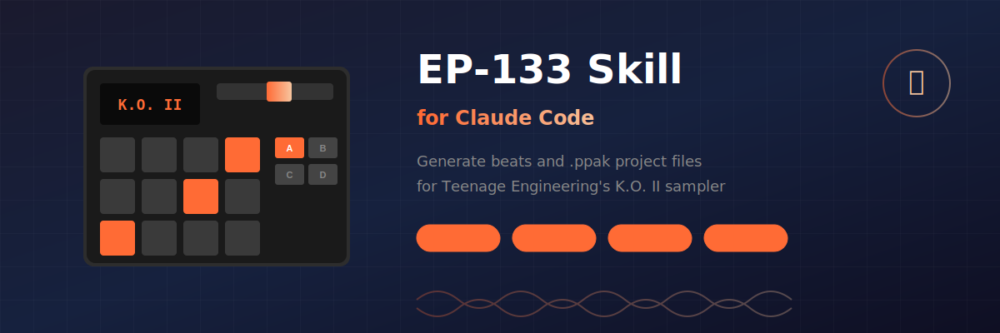

<p align="center">
  
</p>

<h1 align="center">🎛️ EP-133 K.O. II Skill for Claude</h1>

<p align="center">
  <strong>Create beats and project files for the Teenage Engineering EP-133 sampler using AI</strong>
</p>

<p align="center">
  <a href="https://teenage.engineering/products/ep-133">EP-133 Product Page</a> •
  <a href="https://teenage.engineering/apps/ep-sample-tool">EP Sample Tool</a> •
  <a href="#installation">Installation</a> •
  <a href="#usage">Usage</a>
</p>

---

## What is this?

This is a **Claude Code skill** that enables Claude to create `.ppak` project files for the [Teenage Engineering EP-133 K.O. II](https://teenage.engineering/products/ep-133) sampler.

With this skill, you can:

- 🥁 **Generate beats** in any genre (Lo-Fi, Trap, House, Phonk, Boom Bap, etc.)
- 🎹 **Assign samples** to pads across all 4 groups (A, B, C, D)
- 🎼 **Program patterns** with precise timing and velocity
- 📦 **Export .ppak files** ready to load via the EP Sample Tool

---

## How It Works

```
┌─────────────────┐     ┌─────────────────┐     ┌─────────────────┐
│                 │     │                 │     │                 │
│   You + Claude  │────▶│   .ppak File    │────▶│  EP Sample Tool │
│                 │     │                 │     │                 │
│  "Make me a     │     │  Generated by   │     │  Upload to your │
│   phonk beat"   │     │  Claude         │     │  EP-133         │
│                 │     │                 │     │                 │
└─────────────────┘     └─────────────────┘     └─────────────────┘
```

1. **Chat with Claude** - Describe the beat you want
2. **Claude generates** - Creates a `.ppak` project file
3. **Upload via [EP Sample Tool](https://teenage.engineering/apps/ep-sample-tool)** - Load it onto your EP-133
4. **Play!** - Your AI-generated beat is ready

---

## Installation

### For Claude Code Users

1. Clone this repo into your skills directory:
   ```bash
   git clone https://github.com/DannyDesert/EP133-skill.git ~/.claude/skills/ep133-pak
   ```

2. The skill will automatically be available in Claude Code

### For Claude Desktop (Cowork Mode)

1. Download and unzip this repository
2. Place the `ep133-skill` folder in your mounted workspace
3. Claude will detect and use the skill when you ask about EP-133

---

## Usage

### Basic Example

Just ask Claude naturally:

> "Create a trap beat for my EP-133 with heavy 808s and hi-hat rolls"

Claude will:
1. Set up samples on the appropriate pads
2. Program the pattern with proper timing
3. Generate a `.ppak` file you can download

### Getting Your Device SKU

For the generated file to work, Claude needs your device's SKU. Get it by:

1. Open [EP Sample Tool](https://teenage.engineering/apps/ep-sample-tool)
2. Connect your EP-133
3. Create a backup
4. Share the backup file with Claude

Claude will extract the SKU automatically.

### Example Prompts

| Prompt | What Claude Creates |
|--------|---------------------|
| "Make a lo-fi hip hop beat with dusty drums" | Swung groove, vinyl snares, airy hats |
| "Create a 4-on-the-floor house pattern" | Classic kick pattern, offbeat hats, disco claps |
| "I want a jungle/DnB breakbeat" | Chopped amen-style break at 160+ BPM |
| "Generate something weird and experimental" | Polyrhythmic chaos, glitchy textures |

---

## File Structure

```
ep133-skill/
├── SKILL.md                    # Main skill instructions for Claude
├── LICENSE.txt                 # MIT License
├── README.md                   # You are here
├── scripts/
│   └── create_ppak.py          # Python library for .ppak creation
└── references/
    ├── format-details.md       # Complete binary format documentation
    └── sample-beats.md         # Genre templates and patterns
```

---

## Technical Details

This skill documents the reverse-engineered `.ppak` file format:

- **ZIP structure** with leading-slash paths
- **TAR archive** containing pads, patterns, and settings
- **Binary pattern format** (8 bytes per event)
- **Group/pattern relationship** (pattern filename determines sample group)

See [references/format-details.md](references/format-details.md) for complete specifications.

---

## Requirements

- [Teenage Engineering EP-133 K.O. II](https://teenage.engineering/products/ep-133)
- [EP Sample Tool](https://teenage.engineering/apps/ep-sample-tool) (browser-based, works with Chrome)
- Claude Code or Claude Desktop with skill support

---

## Credits

- **Reverse engineering & skill creation**: Claude + human collaboration
- **EP-133 K.O. II**: [Teenage Engineering](https://teenage.engineering)

---

<p align="center">
  <sub>Not affiliated with Teenage Engineering. This is a community tool.</sub>
</p>
